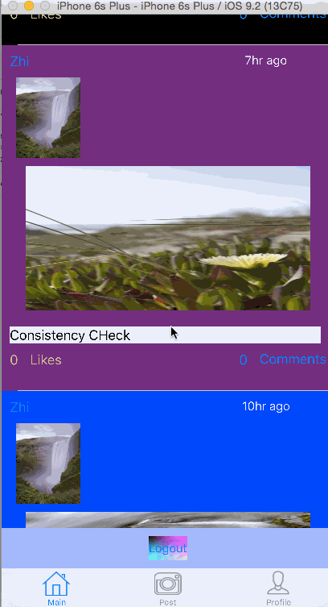

# CPUInstagram
# Project 6 - Instapost

**Name of your app** is a photo sharing app using Parse as its backend.

Time spent: 17 hours spent in total

## User Stories

The following **required** functionality is completed:

- [x] User can sign up to create a new account using Parse authentication
- [x] User can log in and log out of his or her account
- [x] The current signed in user is persisted across app restarts
- [x] User can take a photo, add a caption, and post it to "Instagram"
- [x] User can view the last 20 posts submitted to "Instagram"

The following **optional** features are implemented:

- [x] Show the username and creation time for each post
- [x] After the user submits a new post, show a progress HUD while the post is being uploaded to Parse.
- [ ] User Profiles:
   - [x] Allow the logged in user to add a profile photo
   - [x] Display the profile photo with each post
   - [ ] Tapping on a post's username or profile photo goes to that user's profile page

The following **additional** features are implemented:

- [ ] List anything else that you can get done to improve the app functionality!
- [x] Cells background are in order of UIColor.blackColor(), UIColor.purpleColor(), UIColor.blueColor(), UIColor.redColor(), UIColor.grayColor() alternating
- [x] Automatically goes to tab controller after posting image, and automatically reloads table
- [x] User can't take photo when camera is unavailable
- [x] Pull to refresh though i think unnecesary for this app

Please list two areas of the assignment you'd like to **discuss further with your peers** during the next class (examples include better ways to implement something, how to extend your app in certain ways, etc):

1. The profile would've been much easier to implement if it was worked around from the very beggining. Trying to incorporate in created a lot of headaches.
2. Use of NSNotifications and observers in conjection with didSets

Extras:
Models built to be extended.

Thoughts on improvements for project or course in general:
1. Teach more on shallow/deep copies and how to (Didnt find any guides)
2. NSNotifications/Observers
3. More on asynchronous/synchronous calls and how to do both more efficiently and when one is better than the other with examples
4. 

## Video Walkthrough 

Here's a walkthrough of implemented user stories:

The image of the laptop is meant to show that taking a picture via iPhone works
[Part 1]

When i get the remainder of the optionals done.

Note: Delay on new login due to design to parse out all the information in array properly before using the array to use.

[Part 2]

When i get the last optional and some extras done

[Part 3]

GIF created with [LiceCap](http://www.cockos.com/licecap/).

## Notes

Describe any challenges encountered while building the app.

## License

    Copyright [yyyy] [name of copyright owner]

    Licensed under the Apache License, Version 2.0 (the "License");
    you may not use this file except in compliance with the License.
    You may obtain a copy of the License at

        http://www.apache.org/licenses/LICENSE-2.0

    Unless required by applicable law or agreed to in writing, software
    distributed under the License is distributed on an "AS IS" BASIS,
    WITHOUT WARRANTIES OR CONDITIONS OF ANY KIND, either express or implied.
    See the License for the specific language governing permissions and
    limitations under the License.

## Changes Since Submission for class P1.0

- [x] Refactored Code. Data loads much faster, run time might've tripled with how slow the previous iteration was (way too much calls that could be cut with better architecture). Areas that were hit: Main(table) view controller, profile view controller.
- [x] Added a nifty custom picker for inputting birthdate
- [x] Users can edit profile pictures. Main data feed is dynamically updated with changes to profile.
- [x] Moved Post button to a more reasonable location in the imageViewController so keyboard doesn't get in the way.
- [x] Added alerts for error messages with initial login screen
- [x] Safer methods of unwrapping. changing from force unwrap -> if let
- [ ] Interactive View that displays current user, user information and avatar alongside the main data feed. Can drag said information and objects within the panel.(Currently incomplete *)

Gif of P1.0 Changes

GIF created with [LiceCap](http://www.cockos.com/licecap/).

* Constraints getting in the way of moving view around (in super view controller not in reusable model file)
